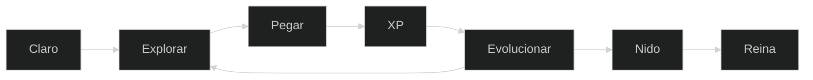
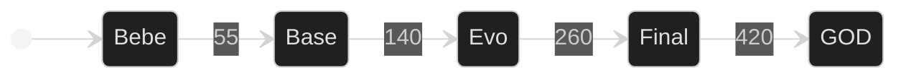
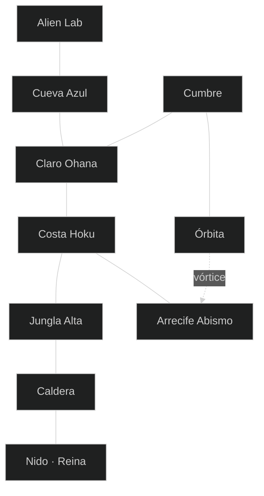
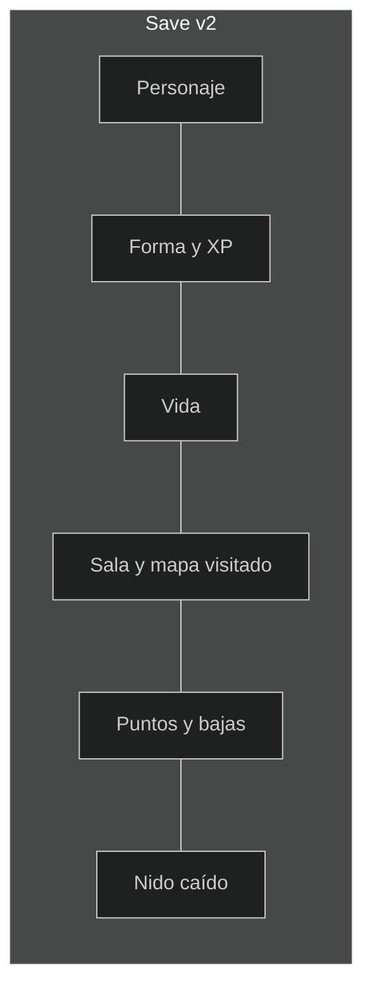

<div align="center">

<a href="https://gracianb.github.io/project-ohana/">
  
</a>

<a href="https://gracianb.github.io/project-ohana/">
  
</a>

<br/>

<a href="https://gracianb.github.io/project-ohana/"></a>
<a href="https://gracianb.github.io/systems-lab/"></a>
<a href="https://gracianb.github.io/GracianB/"></a>

<br/><br/>


</div>

---

<div align="center">

### [Abrir el juego](https://gracianb.github.io/project-ohana/)

Nueva partida: bebé, en el Claro. Continuar: tu forma y tu sala. Si la Reina cae, la partida queda como Ohana completado.


</div>

---

## El bucle



Cinco formas. El XP es absoluto: al llegar al número, esa es la forma. No se suman entre sí.



Con la barra llena, <kbd>E</kbd> evoluciona. Hay cinemática. Las chispas pasan por detrás de la cara.

Un golpe normal para el mundo un instante. Un golpe gordo —forma alta, Dino, o un poder de 40 o más— lo para más rato y el número sale en dorado. El combo se queda desde el primer golpe. Se rompe si te dan, o si pasas unos ocho segundos sin pegar. La puerta espera medio segundo y entonces te suelta.

---

## Elenco

Diez personajes originales. La <kbd>H</kbd> es siempre un golpe cercano y no cambia de nombre al evolucionar. <kbd>J</kbd> <kbd>K</kbd> <kbd>L</kbd> son los tres poderes, y esos sí cambian con la forma.

<table>
<tr>
<td align="center"></td>
<td align="center"></td>
<td align="center"></td>
<td align="center"></td>
<td align="center"></td>
</tr>
<tr>
<td align="center"></td>
<td align="center"></td>
<td align="center"></td>
<td align="center"></td>
<td align="center"></td>
</tr>
</table>

| Personaje | Golpe con H | Pasiva | GOD |
| --- | --- | --- | --- |
| **Kilo** | Nota | Caída lenta. En GOD, un vuelo corto | KILO GOD |
| **Pizza** | Porción | Caer sobre un bicho lo aplasta y te rebota | PIZZA GOD |
| **Michi** | Zarpazo | Aguanta un golpe mortal por sala | MICHI GOD |
| **Cuerno** | Puya | Al caer, el cuerno brilla y te da un saltito | CUERNO GOD |
| **Chispín** | Chispa | Tras correr un segundo va más rápido y deja chispas | CHISPÍN GOD |
| **Stitcho** | Zarpa | Se agarra a las paredes y trepa | STITCHO GOD |
| **Dragón** | Garra | Mantén el salto para planear. En GOD, vuela | DRAGÓN GOD |
| **Dino** | Mordisco | Abajo en el aire: picado con onda | DINO GOD |
| **Frita** | Corte | Abajo mientras corres: se desliza y arrolla | KÉTCHUP GOD |
| **Yomi** | Fauces | Cae más rápido. En el aire, salto es un paso espectral | YOMI FAUCES |

La dificultad es la de la portada. Fácil se lee pronto. Difícil pide más la sala.

---

## Isla Hoku

Diez salas. Visitar Claro, Costa, Jungla, Caldera, Cueva, Lab, Cumbre y Órbita despierta el Nido. El Arrecife es el desvío del agua.



| Sala | Para entrar | Qué hace |
| --- | --- | --- |
| **Claro Ohana** | — | Centro. Este costa, oeste cueva, arriba cumbre. |
| **Costa Hoku** | — | El hueco baja al Arrecife. Este, la jungla, pide forma 3. |
| **Jungla Alta** | Forma 3 | El hueco o el vórtice bajan a la Caldera. |
| **Caldera** | Forma 4 | Este es el Nido. |
| **Nido Final** | Forma 4 | La Reina. No se sale a medias. |
| **Cueva Azul** | — | Oeste, el Lab, pide forma 2. |
| **Alien Lab** | Forma 2 | Solo se vuelve por el este. |
| **Cumbre** | — | El hueco devuelve al Claro. Este, la Órbita. |
| **Órbita** | Forma 2 | Un vórtice secreto baja al Arrecife. |
| **Arrecife Abismo** | — | Agua. Arriba vuelve a la Costa. |

La catapulta y el vórtice también cambian de sala. Se usan con <kbd>E</kbd>.

---

## Las dos manos

<table>
<tr>
<td width="50%" valign="top">

### Izquierda · mover

| Tecla | Acción |
| --- | --- |
| <kbd>W</kbd> <kbd>A</kbd> <kbd>S</kbd> <kbd>D</kbd> | Caminar. También las flechas |
| <kbd>W</kbd> o espacio | Saltar |
| <kbd>S</kbd> o <kbd>↓</kbd> | Soltar una plataforma. En el aire, la pasiva de algunos |
| <kbd>Shift</kbd> | Dash |

</td>
<td width="50%" valign="top">

### Derecha · pegar

| Tecla | Acción |
| --- | --- |
| <kbd>H</kbd> | Golpe normal. También vale <kbd>F</kbd> |
| <kbd>J</kbd> <kbd>K</kbd> <kbd>L</kbd> | Poder corto, medio y definitivo |
| <kbd>E</kbd> | Evolucionar, catapulta o vórtice |
| <kbd>R</kbd> | Volver al Claro |
| <kbd>M</kbd> | Mapa |
| <kbd>º</kbd> | Ayuda |
| <kbd>N</kbd> | Silencio |
| <kbd>Esc</kbd> | Pausa |

</td>
</tr>
</table>

En el teléfono hay botones en pantalla. El juego está pensado primero para teclado.

---

## Qué recuerda la partida

Al cruzar una puerta se guarda la versión 2.



Continuar no mezcla personajes. Una partida de Kilo no abre a Dino. Los ids viejos de prueba `lilo`, `stitch` y `pikachu` se leen como Kilo, Stitcho y Chispín.

---

## Hecho en el navegador

<table>
<tr>
<td width="58%" valign="top">

Canvas 2D a la resolución de la pantalla. JavaScript en módulos, sin framework. HTML y CSS para el marco. Teclado y botones táctiles. Publicado en GitHub Pages.

Los personajes son vector y se animan. Cucaracho, mosquito y cangrejo tienen cara, paso, aviso y embestida. El jefe es la Reina del Nido.

Doble clic en `index.html` no arranca: los módulos no cargan por `file://`.

</td>
<td width="42%" valign="top">

<a href="https://github.com/GracianB/project-ohana">
  
</a>

</td>
</tr>
</table>

<details>
<summary><b>Jugar en local y pasar los tests</b></summary>

<br/>

```powershell
cd project-ohana
python -m http.server 8080
```

Abre [http://localhost:8080](http://localhost:8080).

```powershell
node --test tests/core.test.js
```

</details>

---

## Original

Nombres, dibujos, salas y poderes son de Ohana. No hay marcas de terceros ni afiliación con ninguna. Isla, criatura, dragón, evolución y jefe son el lenguaje del género. El universo concreto es este.

**MIT © 2026 Gracián Baena**

---

<div align="center">

<a href="https://gracianb.github.io/project-ohana/">
  
</a>

<br/>

[Hub](https://gracianb.github.io/GracianB/) · [Systems Lab](https://gracianb.github.io/systems-lab/) · [Experience](https://gracianb.github.io/professional-deck/) · [Yoga](https://gracianb.github.io/yoga-instructor/)

<sub>PLAY · Murcia · 2026</sub>

</div>
