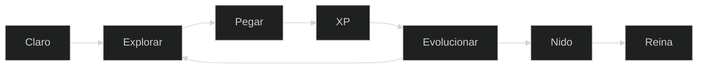
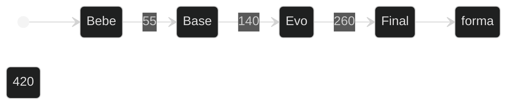
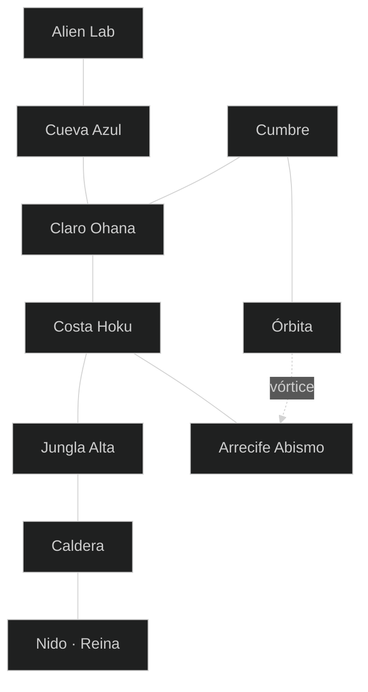
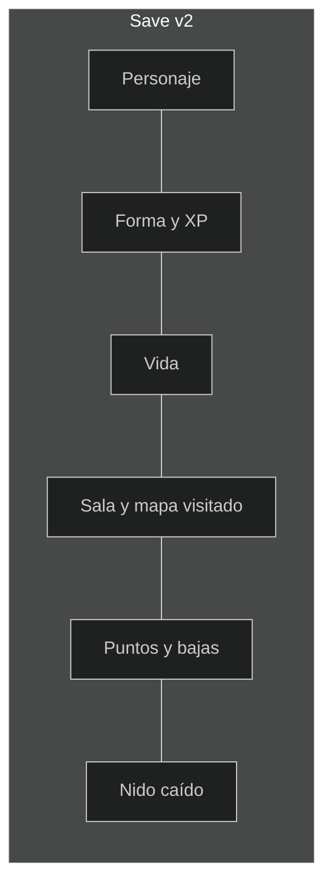

<div align="center">

<a href="https://gracianb.github.io/project-ohana/">
  
</a>

<a href="https://gracianb.github.io/project-ohana/">
  
</a>

<br/>

<a href="https://gracianb.github.io/project-ohana/"></a>
<a href="https://gracianb.github.io/systems-lab/"></a>
<a href="https://gracianb.github.io/GracianB/"></a>

<br/><br/>


</div>

---

<div align="center">

#### Evolución

La cinemática de evolución refuerza la identidad de cada héroe y etapa con firmas visuales específicas durante la transformación.

## [Abrir el juego](https://gracianb.github.io/project-ohana/)

Nueva partida: bebé, en el Claro. Continuar: tu forma y tu sala. Si la Reina cae, la partida queda como Ohana completado.


</div>

---

## El bucle


```mermaid
%%{init: {'theme':'dark'}}%%
flowchart LR
  A[Claro] --> B[Explorar]
  B --> C[Pegar]
  C --> D[XP]
  D --> E[Evolucionar]
  E --> B
  E --> F[Nido]
  F --> G[Reina]
```

Cinco formas. El XP es absoluto: al llegar al número, esa es la forma. No se suman entre sí.


```mermaid
%%{init: {'theme':'dark'}}%%
stateDiagram-v2
  direction LR
  [*] --> Bebe
  Bebe --> Base: 55
  Base --> Evo: 140
  Evo --> Final: 260
  Final --> forma final: 420
```

Al llenar la barra, evolucionas automáticamente. Hay cinemática. Las chispas pasan por detrás de la cara. <kbd>E</kbd> usa portales y catapultas; en móvil hay un botón E. Cada forma tiene además una lectura propia de postura, escalado visual y firma de evolución; las 50 combinaciones personaje × forma se mantienen separadas de la hitbox y la física. En combate, las firmas de H/J/K/L también escalan visualmente por forma sin alterar daño, alcance ni hitbox.

La Reina del Nido ya no selecciona golpes aislados. Cada fase usa rutinas encadenadas:
- **Fase 1 · TERRITORIO**: secuencias cortas de presión y respuesta.
- **Fase 2 · ASCENSO**: zambullida, proyectil y embestida se combinan en rutas de tres pasos.
- **Fase 3 · APOCALIPSIS**: cadenas de hasta cuatro ataques con menos hueco entre movimientos.
Tras cada rutina existe una **ventana de castigo** claramente telegráfica. La selección considera distancia y altura del jugador, recuerda el comportamiento reciente del jugador (dash, aire y presión) y evita repetir la misma rutina consecutivamente. En fase 3, con la Reina por debajo del 22% de vida, entra en **desesperación** y prioriza una presión final determinista. Una defensa limpia con **DASH**, **AIRE** o **DISTANCIA** genera una respuesta puntuable; tres respuestas consecutivas abren un **BREAK** que amplía la recuperación vulnerable del boss. Golpear durante esa ventana mantiene además el **PUNISH** único por ciclo. Después de cada respuesta limpia, la Reina conserva memoria corta de DASH/AIRE/DISTANCIA; si una defensa se repite, cambia su siguiente preferencia dentro de las rutinas autorizadas y puede marcar **CEBO** para forzar variedad. La memoria es acotada, determinista y se enfría con respuestas mezcladas. El sistema no altera daño base ni hitboxes.

Un golpe normal para el mundo un instante. Un golpe gordo —forma alta, Dino, o un poder de 40 o más— lo para más rato y el número sale en dorado. El combo se queda desde el primer golpe. Se rompe si te dan, o si pasas unos ocho segundos sin pegar. La puerta espera medio segundo y entonces te suelta.

---

## Elenco

Diez personajes originales. La <kbd>H</kbd> es siempre un golpe cercano y no cambia de nombre al evolucionar. <kbd>J</kbd> <kbd>K</kbd> <kbd>L</kbd> son los tres poderes, y esos sí cambian con la forma.

<table>
<tr>
<td align="center"></td>
<td align="center"></td>
<td align="center"></td>
<td align="center"></td>
<td align="center"></td>
</tr>
<tr>
<td align="center"></td>
<td align="center"></td>
<td align="center"></td>
<td align="center"></td>
<td align="center"></td>
</tr>
</table>

| Personaje | Golpe con H | Pasiva | forma final |
| --- | --- | --- | --- |
| **Kilo** | Nota | Caída lenta. En forma final, un vuelo corto | KILO forma final |
| **Pizza** | Porción | Caer sobre un bicho lo aplasta y te rebota | PIZZA forma final |
| **Michi** | Zarpazo | Aguanta un golpe mortal por sala | MICHI forma final |
| **Cuerno** | Puya | Al caer, el cuerno brilla y te da un saltito | CUERNO forma final |
| **Chispín** | Chispa | Tras correr un segundo va más rápido y deja chispas | CHISPÍN forma final |
| **Stitcho** | Zarpa | Se agarra a las paredes y trepa | STITCHO forma final |
| **Dragón** | Garra | Mantén el salto para planear. En forma final, vuela | DRAGÓN forma final |
| **Dino** | Mordisco | Abajo en el aire: picado con onda | DINO forma final |
| **Frita** | Corte | Abajo mientras corres: se desliza y arrolla | KÉTCHUP forma final |
| **Yomi** | Fauces | Cae más rápido. En el aire, salto es un paso espectral | YOMI FAUCES |

La dificultad es la de la portada. Fácil se lee pronto. Difícil pide más la sala.

---

## Isla Hoku

Diez salas. Visitar Claro, Costa, Jungla, Caldera, Cueva, Lab, Cumbre y Órbita despierta el Nido. El Arrecife es el desvío del agua.


```mermaid
%%{init: {'theme':'dark'}}%%
flowchart TB
  ridge[Cumbre] --- space[Órbita]
  lab[Alien Lab] --- cave[Cueva Azul] --- hub[Claro Ohana] --- beach[Costa Hoku] --- jungle[Jungla Alta]
  ridge --- hub
  beach --- reef[Arrecife Abismo]
  space -.->|vórtice| reef
  jungle --- volcano[Caldera] --- boss[Nido · Reina]
```

| Sala | Para entrar | Qué hace |
| --- | --- | --- |
| **Claro Ohana** | — | Centro. Este costa, oeste cueva, arriba cumbre. |
| **Costa Hoku** | — | El hueco baja al Arrecife. Este, la jungla, pide forma 3. |
| **Jungla Alta** | Forma 3 | El hueco o el vórtice bajan a la Caldera. |
| **Caldera** | Forma 4 | Este es el Nido. |
| **Nido Final** | Forma 4 | La Reina. No se sale a medias. |
| **Cueva Azul** | — | Oeste, el Lab, pide forma 2. |
| **Alien Lab** | Forma 2 | Solo se vuelve por el este. |
| **Cumbre** | — | El hueco devuelve al Claro. Este, la Órbita. |
| **Órbita** | Forma 2 | Un vórtice secreto baja al Arrecife. |
| **Arrecife Abismo** | — | Agua. Arriba vuelve a la Costa. |

La catapulta y el vórtice también cambian de sala. Se usan con <kbd>E</kbd>.

---

## Las dos manos

<table>
<tr>
<td width="50%" valign="top">

### Izquierda · mover

| Tecla | Acción |
| --- | --- |
| <kbd>W</kbd> <kbd>A</kbd> <kbd>S</kbd> <kbd>D</kbd> | Caminar. También las flechas |
| <kbd>W</kbd> o espacio | Saltar |
| <kbd>S</kbd> o <kbd>↓</kbd> | Soltar una plataforma. En el aire, la pasiva de algunos |
| <kbd>Shift</kbd> | Dash |

</td>
<td width="50%" valign="top">

### Derecha · pegar

| Tecla | Acción |
| --- | --- |
| <kbd>H</kbd> | Golpe normal. También vale <kbd>F</kbd> |
| <kbd>J</kbd> <kbd>K</kbd> <kbd>L</kbd> | Poder corto, medio y definitivo |
| <kbd>E</kbd> | Interactuar con catapulta o vórtice. La evolución es automática |
| <kbd>R</kbd> | Volver al Claro |
| <kbd>M</kbd> | Mapa |
| <kbd>º</kbd> | Ayuda |
| <kbd>N</kbd> | Silencio |
| <kbd>Esc</kbd> | Pausa |

</td>
</tr>
</table>

En el teléfono hay botones en pantalla. El juego está pensado primero para teclado.

---

## Qué recuerda la partida

El guardado v2 conserva personaje, forma, sala, salud, magia y victoria. Se actualiza al cruzar puertas, evolucionar, completar el juego, pausar y volver al menú, y cada cinco segundos de simulación activa. Perder el foco pausa la partida y limpia las teclas; al ocultar o cerrar la página se intenta guardar. Si el navegador bloquea el almacenamiento, aparece un aviso y la partida puede seguir sin guardado persistente.


```mermaid
%%{init: {'theme':'dark'}}%%
flowchart LR
  subgraph partida [Save v2]
    id[Personaje]
    evo[Forma y XP]
    hp[Vida]
    room[Sala y mapa visitado]
    score[Puntos y bajas]
    won[Nido caído]
  end
  id --- evo --- hp --- room --- score --- won
```

Continuar no mezcla personajes. Una partida de Kilo no abre a Dino. Los ids viejos de prueba `lilo`, `stitch` y `pikachu` se leen como Kilo, Stitcho y Chispín.

---

## Hardening de runtime

El bucle principal también contiene fallos inesperados de simulación o render: registra el error, limpia el estado de entrada y pausa la partida en lugar de dejar morir el ciclo de animación.

El runtime aplica un guard de integridad antes de cada paso de simulación para normalizar HP, XP, puntuación, movimiento y colecciones transitorias ante valores no finitos o estados corruptos. Los límites de runtime y los VFX de portales deterministas se mantienen separados de la lógica de gameplay.

## Hecho en el navegador

<table>
<tr>
<td width="58%" valign="top">

Canvas 2D a la resolución de la pantalla. JavaScript en módulos, sin framework. La simulación tiene un paso fijo de 60 Hz, independiente de la frecuencia de la pantalla, con recuperación de atrasos limitada. HTML y CSS para el marco. Teclado y botones táctiles, incluido E para interactuar. Diálogos con foco contenido y barras de estado accesibles. Publicado en GitHub Pages después de pasar las pruebas.

Los personajes son vector y se animan. Cucaracho, mosquito y cangrejo tienen cara, paso, aviso y embestida. El jefe es la Reina del Nido.

Doble clic en `index.html` no arranca: los módulos no cargan por `file://`.

</td>
<td width="42%" valign="top">

<p align="center">
  <a href="https://github.com/GracianB/project-ohana"></a>
  <br/><br/>
  
  <br/><br/>
  
  <br/><br/>
  
</p>

</td>
</tr>
</table>

<details>
<summary><b>Jugar en local y pasar los tests</b></summary>

<br/>

```powershell
cd project-ohana
python -m http.server 8080
```

Abre [http://localhost:8080](http://localhost:8080).

```powershell
node --test tests/core.test.js tests/runtime.test.js
```

</details>

---

## Original

Nombres, dibujos, salas y poderes son de Ohana. No hay marcas de terceros ni afiliación con ninguna. Isla, criatura, dragón, evolución y jefe son el lenguaje del género. El universo concreto es este.

**MIT © 2026 Gracián Baena**

---

<div align="center">

<a href="https://gracianb.github.io/project-ohana/">
  
</a>

<br/>

[Hub](https://gracianb.github.io/GracianB/) · [Systems Lab](https://gracianb.github.io/systems-lab/) · [Experience](https://gracianb.github.io/professional-deck/) · [Yoga](https://gracianb.github.io/yoga-instructor/)

<sub>PLAY · Murcia · 2026</sub>

</div>


## Boss Director · Phases 15–21

La Reina del Nido evoluciona en capas deterministas de dirección de combate:

- **Phase 15 · Combat Director**: rutinas encadenadas, selección contextual y recuperación vulnerable.
- **Phase 16 · Reactive Director**: memoria de dash/aire/presión y respuesta contextual.
- **Phase 17 · Counterplay**: DASH/AIRE/DISTANCIA, racha defensiva y BREAK.
- **Phase 18 · Adaptive Encounter**: memoria corta de respuestas repetidas y cambio de preferencia dentro del repertorio autorizado.
- **Phase 19 · Adaptive Bait**: dos respuestas iguales arman un CEBO de un solo uso; el patrón señuelo ya existe en la tabla de rutinas de la fase y no cambia daño ni hitboxes.
- **Phase 21 · Encounter Memory**: la Reina conserva una memoria de ocho observaciones como máximo y ajusta la longitud de la siguiente rutina hacia corta o larga según la lectura del jugador, siempre dentro del repertorio autorizado.

La adaptación es determinista, acotada y separada de la simulación física. El objetivo es aumentar la lectura del combate, no hacer trampas cambiando reglas invisibles.

## Boss Director · Phase 20

Phase 20 añade feedback de resultado al sistema de adaptación: un CEBO que el jugador identifica reduce el tempo de la Reina, mientras un CEBO eficaz lo incrementa. El efecto está limitado a la cadencia de decisión del siguiente ciclo y no modifica daño, hitboxes, física ni RNG.

## Boss Director · Phase 21

Phase 21 añade memoria corta del encuentro. Las respuestas limpias y los CEBO leídos relajan la selección hacia rutinas más cortas; los fallos y CEBO eficaces elevan la presión hacia rutinas más largas. El historial está limitado a ocho observaciones y la selección sigue cerrada a los patrones autorizados de cada fase.

## Ability Fix · Kilo + Pizza

Se corrigió una regresión de habilidades: el segundo ataque de Kilo (`Giro hula`) ahora tiene ciclo de impacto real y el agarre de queso de Pizza tiene duración limitada, permite contramovimiento y se cancela al lanzar otra habilidad. Las tres habilidades de Pizza quedan cubiertas por pruebas de impacto. Caché `ohana-98`.


## Cache Graph Closure · Phase 40

El Service Worker precachea el conjunto completo de módulos JavaScript del runtime con la versión actual de caché. El CI comprueba que `index.html` y `sw.js` usan la misma versión y que ningún módulo `.js` de producción queda fuera del precache.

## CI Hardening

GitHub Actions usa `actions/checkout@v7` y `actions/setup-node@v7`, ejecuta el pipeline con límites de tiempo y conserva regresión, E2E de navegador y consistencia antes de publicar.


## RNG Domain Separation

El RNG de simulación no es consumido por el render ni por VFX de presentación. La cámara, partículas y cinemáticas usan una semilla determinista derivada del tick, manteniendo la reproducibilidad del combate independiente de la frecuencia de render.

## Deterministic Gameplay Core · Phase 33

Las decisiones jugables de sorpresas y lluvia consumen RNG inyectable de simulación. La convocatoria del Nido utiliza 132 ticks de simulación en lugar de `setTimeout`, por lo que la espera se pausa con la partida y no depende del reloj de pared.
